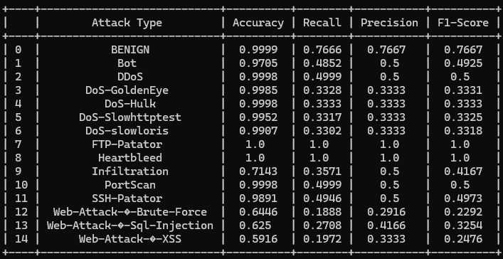
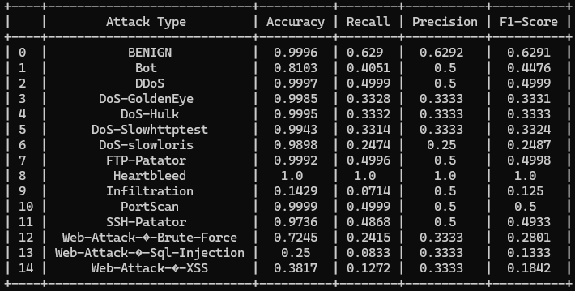
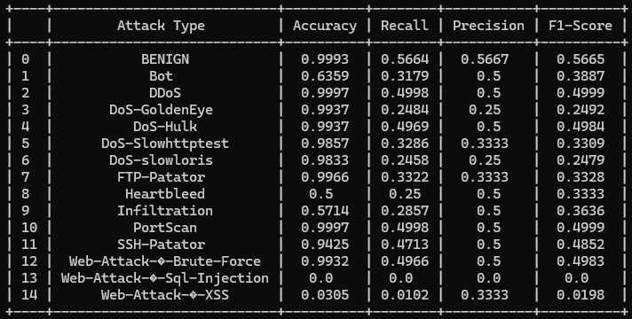

W.I.P Project

# Machine Learning / Deep Learning Intrusion Detection System (IDS

Collaboration effort by Quy Nguyen, Ngan Kha and Yen Do

## Project Description:

- This project implements a Machine Learning based Intrusion Detection System using the CIC-IDS2017 dataset. Currently, there is only the Random Forest Model instead of having 2 more, consisting of KNN and SVM models, which were taken out for a remaster.

## Structure:

- data folder: contains at least two more folders, one containing the original dataset downloaded from the Canadian Institute for Cybersecurity and a cleaned\_dataset folder, created during the preprocess procedure. More folders will be created after running your specific machine learning models, containing the results of the ML execution.

- script folder: contains all scripts of the project, including:

+ preprocess.py: perform data cleaning (ensuring NaN, rounding to a definite value, and dropping duplicates)

+ machine learning models: Python scripts that uses specific ML models such as Random Forest. Other scripts are not yet included.

+ combined\_evaluation\_results.py: script used to display all evaluation metrics my all the models for easier comparision, though only random forest is read as of right now.

## Setup:

- Please be in the main directory of the project in your terminal, and setup a virtual environment such as venv.

- From there, ensure that specific packages are installed, including these (subject to change as project grows):

+ pandas

+ numpy

+ scikit-learn

+ matplotlib

+ seaborn

+ jupyter

+ tabulate

- Ensure that the .csv dataset are extracted in the data folder so that preprocess.py can read them one by one, so that the data directory should display like this:

Friday-WorkingHours-Afternoon-DDos.pcap\_ISCX

Friday-WorkingHours-Afternoon-PortScan.pcap\_ISCX

Friday-WorkingHours-Morning.pcap\_ISCX

Monday-WorkingHours.pcap\_ISCX

Thursday-WorkingHours-Afternoon-Infilteration.pcap\_ISCX

Thursday-WorkingHours-Morning-WebAttacks.pcap\_ISCX

Tuesday-WorkingHours.pcap\_ISCX

Wednesday-workingHours.pcap\_ISCX

(and any additional content that you may have, such as backup folders)

- Navigate to the script folder, and simply run python3 preprocess.py first. Once done, you can run python3 random_forest.py or any existing models in no particular order, as long as they are ran after preprocess.py and before combined_evaluation_results.py. 
- Running python3 combined_evaluation_results.py will display your model results, which a sample of a random forest run can be seen below:

And here is the result of the KNN Model:

Here is also the result of the MLP Model:

